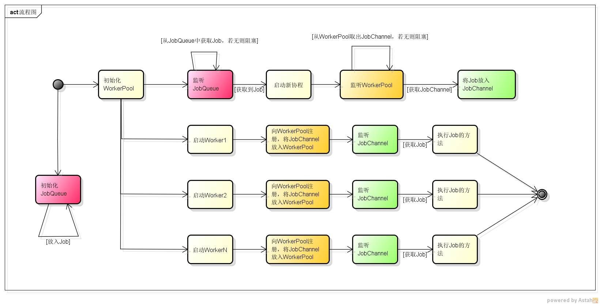

# 关于文章“[使用Go语言每分钟处理1百万请求](https://gocn.vip/article/5)”的实现
# 流程图：

# 说明
1. 使用了文章中的程序代码
2. 让每个Worker执行的任务是：计算第40个斐波那契数字
3. 比较了10秒内并行和串行的方法，执行任务的个数，显然并行的方式会更多
4. 文章说每分钟能处理1百万个请求，但没具体说每个请求的执行效率，并不是特别严谨
5. 欢迎讨论